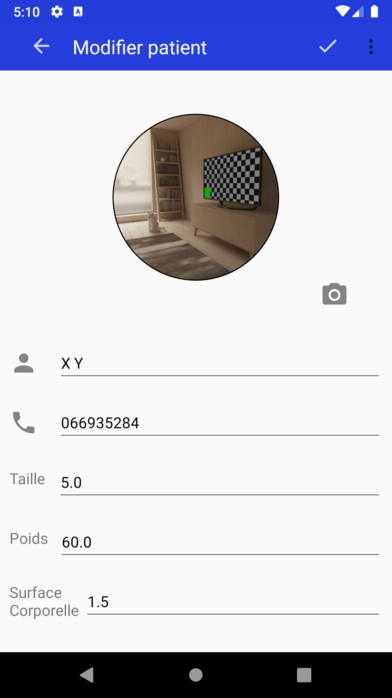
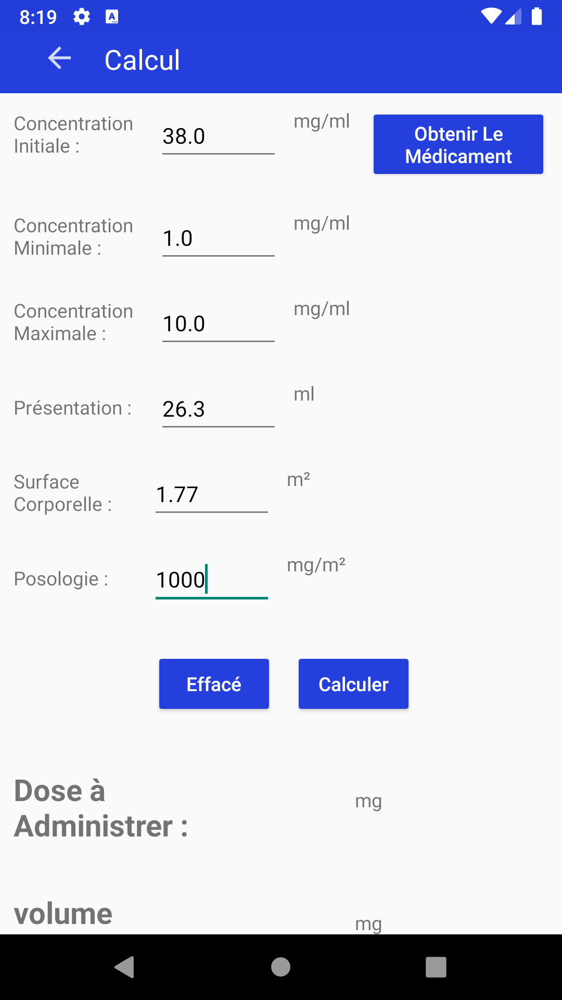

# Ipharm Android Application with Java
An Android application designed to prepare medication solutions with specific calculations, featuring a database management system for medications and clients

##Presentation of the Activities (Interfaces) of the Application
1. On the first launch of the application, the initial interface displays a message that says "Hello". This message moves upwards after a moment with a splash animation and then shows the application's home page. The home page contains the name of the application and four icons. It allows users to view the list of patients, the list of medications, calculate, and see the list of remnants.
  

2. At the beginning of each workday, display a reminder and ask the pharmacist to check the list of medications for those that are expired and those that are not.

     
   If the pharmacist clicks on 'Verify', the page containing the list of remaining medications should be displayed, and if they click on 'No, Thank You', the reminder will disappear, and the homepage will be displayed.

3. It offers users (Pharmacists) 4 choices: View Patients, View Medications, View Remaining Medications, and Perform Calculations. We start on the Patients page. When the user clicks on the 'Patients' icon, the Patients page opens, and for the first time, the list of patients will be empty. From this page, the user can add a new client by clicking the add button at the bottom right of the page or searching for a client via the search bar at the top of the page.
   

4. If the user presses the button to add a new client, the Add Client (Patient) page opens, and they can fill in the client's information. Additionally, if they want to add a photo from the phone's (tablet's) storage or take a photo of the client on the spot using the camera, they just need to press the camera icon.
   
To save the new patient, press the check mark at the top. To cancel the registration, press the back button to return to the previous page.

5. And if the user presses on a client, the page for that patient opens and contains additional information about the patient. From this page, the user can also modify or delete the client, as well as call or send a message to the client through the phone line.
   
   
   
  

6. The same applies to the Medications page with a few small changes.

When the user clicks on the 'Medications' icon, the Medications page opens. The list may initially be empty. From this page, the user can add a new medication by clicking the add button at the bottom right of the page or search for a medication via the search bar at the top of the page.

If the user presses the button to add a new medication, the Add Medication page opens, and they can fill in the medication's information. Additionally, if they want to add a photo from the phone's (tablet's) storage or take a photo on the spot using the camera, they just need to press the camera icon.

To save the new medication, press the check mark at the top. To cancel the registration, press the back button to return to the previous page.

   

From the main Medications page, the user (Pharmacist) can add a medication.

   

When the pharmacist wants to view a particular medication, this is the interface they get:

  

On this interface, the pharmacist will have the following options:

* Call the Manufacturer: The pharmacist can call the laboratory that manufactures the medication.
* Send a Message: The pharmacist can send a message to the manufacturer through the phone line.
* Modify the Medication: The pharmacist can edit the information of the medication.
* Delete the Medication: The pharmacist can delete the medication from the list.

     

* Let's now move to the Calculations page. This section is designed to calculate the dose to administer, the final volume, the number of vials, the most suitable bag type, and the leftover amount. The pharmacist can retrieve the medication information from the database and complete the data entry (Body Surface Area, Dosage), and then press Calculate.

Here's a breakdown of the process:

* Calculations Page: The pharmacist navigates to the Calculations page.

* Retrieve Medication Information: The pharmacist selects a medication from the database to pre-fill the relevant information.

* Data Entry: The pharmacist completes the data entry fields:

* Body Surface Area: Enter the patient's body surface area.
* Dosage: Enter the prescribed dosage.
* Calculate: The pharmacist presses the Calculate button to compute the necessary information, which includes:

* Dose to Administer: The amount of medication required.
* Final Volume: The total volume of the solution.
* Number of Vials: The number of vials needed for the dose.
* Most Suitable Bag Type: The type of bag most appropriate for the solution.
* Leftover Amount: Any remaining amount of the medication.

   

In this step, if the required number of vials is available in stock and everything is correct, the pharmacist can either validate or cancel the calculations. If they validate the calculations, the leftover amount is recorded in the residuals database with the exact date it was stored, and the stock quantity of this medication is decreased. (In this example, we are using the medication M1.)

Here is a detailed breakdown of the process:

Stock Verification: The system checks if the required number of vials of medication M1 is available in stock.

Validation/Cancel Options:

Validate: If the pharmacist validates the calculations:
The leftover amount is saved in the residuals database with the current date.
The stock quantity of medication M1 is decreased accordingly.
Cancel: If the pharmacist cancels, no changes are made to the stock or the residuals database.
Process Workflow:

The pharmacist retrieves medication M1 from the database.
The pharmacist enters the patient's Body Surface Area and Dosage.
The pharmacist presses the Calculate button.
The system computes the necessary information:
Dose to Administer
Final Volume
Number of Vials
Most Suitable Bag Type
Leftover Amount
The system verifies the availability of medication M1 in stock.
If the stock is sufficient, the pharmacist has the option to Validate or Cancel.
On Validation:
The leftover amount is recorded with the current date in the residuals database.
The stock quantity of medication M1 is updated.
On Cancellation:
No updates are made.

   

If the stability of a residual medication is exceeded, the pharmacist can delete it.

Here’s how this process can be incorporated:

1. Residuals Database Monitoring: The system monitors the stability dates of the residual medications in the database.

2. Stability Check: When the pharmacist views the residuals, the system highlights or flags those whose stability period has been exceeded.

3. Delete Option: For residuals with exceeded stability:

   * The pharmacist selects the residual medication that has exceeded its stability.
   * The pharmacist clicks on the Delete option to remove it from the residuals database.
   
4. Confirmation: The system prompts the pharmacist to confirm the deletion to avoid accidental removal.

5. Update Database: Upon confirmation, the residual medication is deleted from the database, ensuring that expired or unstable medications are not used.

Here’s a step-by-step example:

1. Access Residuals: The pharmacist accesses the residuals database.
2. Identify Expired Residuals: The system flags residuals whose stability has been exceeded.
3. Select and Delete: The pharmacist selects an expired residual (e.g., from medication M1) and clicks Delete.
4. Confirm Deletion: A confirmation prompt appears to ensure the pharmacist wants to proceed.
5. Update Database: After confirmation, the residual is removed from the database.

   
